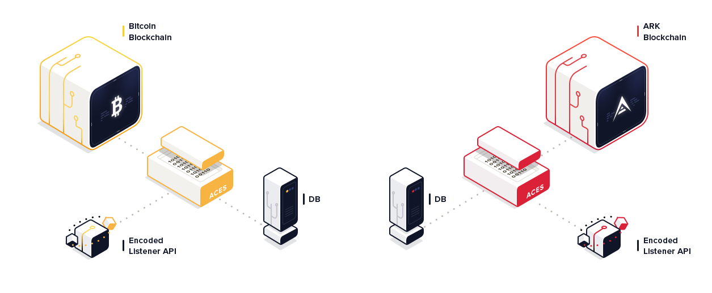

    <section class="container">
        

            

            

                

                    <h2>ACES Listener Plaform</h2>
                    

                        The ACES Listener API provides a way for all the different blockchain transaction events 
                        to be easily consumed via a common REST-ful API.
                    

                

            

        

        
        

            

                
            

        

        
        

            

            

                

                    <h3>
                        API Specification
                    </h3>
                    

                        The ACES Listener API provides a way for all the different blockchain transaction events 
                        to be easily consumed via a common REST-ful API. The API allows consumers to create 
                        subscriptions and receive blockchain events in real-time using Webhook callbacks.
                    

                    

                        <a class="btn-sm btn-shadow btn-shadow-info" href="https://ark-aces.github.io/aces-listener-docs/">
                            Read Specification
                        </a>
                    

                

            

            

                

                    <h3>
                        API Docs
                    </h3>
                    

                        The ACES Listener API provides a way for all the different blockchain transaction events 
                        to be easily consumed via a common REST-ful API. The API allows consumers to create 
                        subscriptions and receive blockchain events in real-time using Webhook callbacks.
                    

                    

                        <a class="btn-sm btn-shadow btn-shadow-info" href="https://ark-aces.github.io/aces-listener-docs/">
                            Read Docs
                        </a>
                    

                

            

        

    </section>

    

        <header>
            <h3>Platform Key Features</h3>
            

                Spacial is an advanced theme solution for desktop, tablet, and mobile devices. It works in all browsers and your clients can pay instantly, to improve their experience at all times anywhere they go.
            

        </header>
        <section class="features">
            

                

                    
                    <section>
                        <h4>
                            Open Source
                        </h4>
                        

                            Everything on the ACES platform is open source and uses a permissive free software license.
                        

                    </section>
                

                

                    
                    <section>
                        <h4>
                            REST-ful APIs
                        </h4>
                        

                            The ACES platform uses simple REST-ful APIs for easy integration.
                        

                    </section>
                

            

            

                

                    
                    <section>
                        <h4>
                            Decentrallized
                        </h4>
                        

                            A marketplace platform that allows users to consume blockchain services offered by a 
                            decentralized collection of service providers. 
                        

                    </section>
                

                

                    
                    <section>
                        <h4>
                            Service Composition Chains
                        </h4>
                        

                            Use functional composition to chain ACES Services together.
                        

                    </section>
                

            

        </section>
    

    

        <header>
            <h4>ACES Service Implementations</h4>
        </header>
        

            

                

                    

                        <a class="btn-block btn-sm btn-shadow btn-shadow-info" href="">Ark Listener</a>
                    

                    

                        <a class="btn-block btn-sm btn-shadow btn-shadow-info" href="">Bitcoin Listener</a>
                    

                    

                        <a class="btn-block btn-sm btn-shadow btn-shadow-info" href="">Ethereum Listener</a>
                    

                

                

                    

                        <a class="btn-block btn-sm btn-shadow btn-shadow-info" href="">Litecoin Listener</a>
                    

                    

                        <a class="btn-block btn-sm btn-shadow btn-shadow-info" href="">Zencash Listener</a>
                    

                

            

        

    

