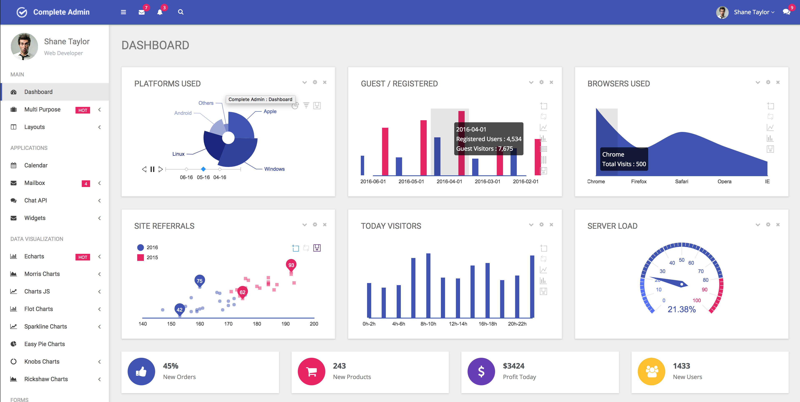
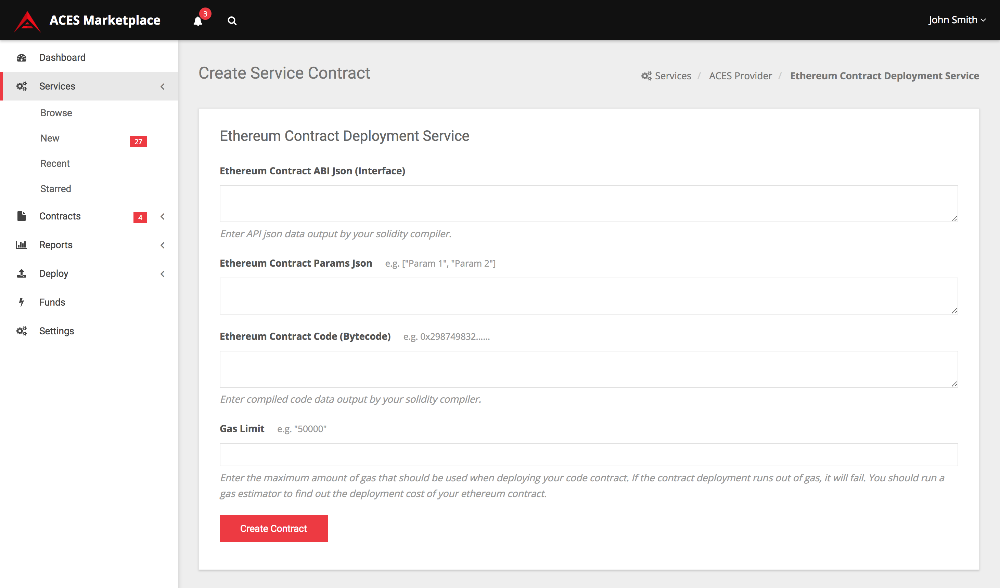

    <section class="container">
        

            

                

                    <h2>ACES Marketplace</h2>
                    

                        Dashboard for searching and executing service contracts
                        and tracking contract executions.
                    

                

            

        

    </section>

<<<<<<< HEAD

    <section>
        

            

                    
                    (placeholder design until marketplace prototype developed)
            

        

    </section>
=======

        
>>>>>>> 2540bb1bd79b360080fb7f736e0e7f9068944540

    

        <header>
            <h3>Platform Key Features</h3>

        </header>
        <section class="features">
            

                

                    
                    <section>
                        <h4>
                            Open Source
                        </h4>
                        

                            Everything on the ACES platform is open source and uses a permissive free software license.
                        

                    </section>
                

                

                    
                    <section>
                        <h4>
                            REST-ful APIs
                        </h4>
                        

                            The ACES platform uses simple REST-ful APIs for easy integration.
                        

                    </section>
                

            

            

                

                    
                    <section>
                        <h4>
                            Decentrallized
                        </h4>
                        

                            A marketplace platform that allows users to consume blockchain services offered by a 
                            decentralized collection of service providers. 
                        

                    </section>
                

                

                    
                    <section>
                        <h4>
                            Service Composition Chains
                        </h4>
                        

                            Use functional composition to chain ACES Services together.
                        

                    </section>
                

            

            

                

                    
                    <section>
                        <h4>
                            Incentivized
                        </h4>
                        

                            The ACES platform provides an open fee model that allows service providers
                            to compete in a fee market.
                        

                    </section>
                

                

                    
                    <section>
                        <h4>
                            Listener Hosting
                        </h4>
                        

                            Provide blockchain data to subscribers with easy to implement fee-based authentication
                        

                    </section>
                

            

        </section>
    

    

        <header>
            <h4>Marketplace Statistics</h4>
        </header>
        

            

                

                    

                        4
                        
Listeners

                    

                    

                        1
                        
Services

                    

                    

                        1
                        
Marketplaces

                    

                    

                        0 BTC
                        
Volume

                    

                

            

        

    

